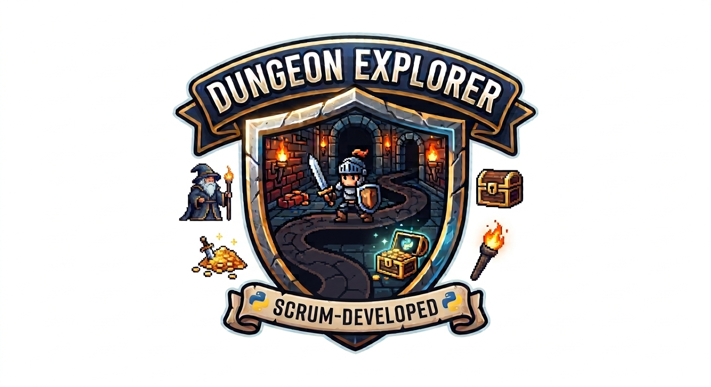

# Dungeon Explorer



You didn't mean to end up here. One minute you were looking for the bathroom at a castle open house, and the next you were at the bottom of a dungeon with nothing but your wits, a flickering torch, and a very unhelpful sense of direction. To your left: sounds of something rustling in the dark. To your right: a distant light that could be an exit — or a very enthusiastic firefly.

The dungeon won't explore itself. Probably.

> **About this project:** Dungeon Explorer is a text adventure game you'll build as a team during an in-class Scrum exercise. The starter already runs — your team's job is to extend it sprint by sprint, using a real product backlog, pull requests, and Scrum roles.

---

## Table of Contents

- [Setup](#setup)
- [Running the Game](#running-the-game)
- [How the Exercise Works](#how-the-exercise-works)
- [Contributing](#contributing)

---

## Setup

### 1. Clone the repo

```bash
git clone https://github.com/<your-org>/<your-team-repo>
cd <your-team-repo>
```

### 2. Create a virtual environment

```bash
python3 -m venv .venv
```

### 3. Activate it

**macOS / Linux:**

```bash
source .venv/bin/activate
```

**Windows:**

```bash
.venv\Scripts\activate
```

### 4. No packages needed

The starter game has zero external dependencies — it uses only Python's built-in `input` and `print`. You don't need to run `pip install` for anything. If you add libraries in a later sprint, put them in a `requirements.txt` and note the install step here.

---

## Running the Game

```bash
python3 game.py
```

On Windows:

```bash
python game.py
```

### What to expect

The game runs entirely in your terminal — no browser, no GUI, no internet connection required. Here's the full experience of the starter:

1. **The welcome banner fires.** `Welcome to Dungeon Explorer!` appears — your hapless hero has arrived.
2. **You're asked your name.** Type anything. The dungeon is non-judgmental.
3. **The first choice.** You're presented with a classic adventurer's dilemma: go `left` or `right`.
   - **Left** — You step off the torch-lit path and into a dark forest. Somewhere in the canopy, something blinks back at you. The starter leaves the rest to your imagination (and your team's backlog).
   - **Right (or anything else)** — A castle looms on the horizon, its towers silhouetted against a dimly glowing sky. Whether that glow is sunrise or a dragon, your next sprint will decide.

That's it — for now. The starter world is intentionally small. Over three sprints your team will flesh out rooms, items, enemies, and whatever else the product owner dreams up. The adventure grows as you build it.

---

## How the Exercise Works

Your team works through three short sprints. Each sprint starts with planning (pick stories from the backlog), followed by development, and ends with a review where you demo what you built.

All work goes through pull requests — no one commits directly to `main`.

The branch and PR workflow is in the [Contributing](#contributing) section below.

---

## Contributing

Every story that gets shipped follows the same path: branch → code → pull request → review → merge. That's the loop. Repeat it every sprint.

### Branch Workflow

1. Pick a story from the backlog (a GitHub issue).
2. Create a branch named after the issue number:

   ```bash
   git checkout -b issue-7-sword-item
   ```

3. Make your changes and commit them.
4. Push your branch and open a pull request against `main`.
5. Ask one teammate to review and approve.
6. Merge only when the acceptance criteria in the issue are met.

### Definition of Done

A story is done when **all four** of these are true:

- [ ] Code is committed on a branch
- [ ] Pull request is open
- [ ] Reviewed and approved by one teammate
- [ ] Merged into `main`

### Rules

- **Do not commit directly to `main`.**
- One branch per issue.
- Keep pull requests small — one story at a time.
- The reviewer checks that the acceptance criteria are met before approving.
